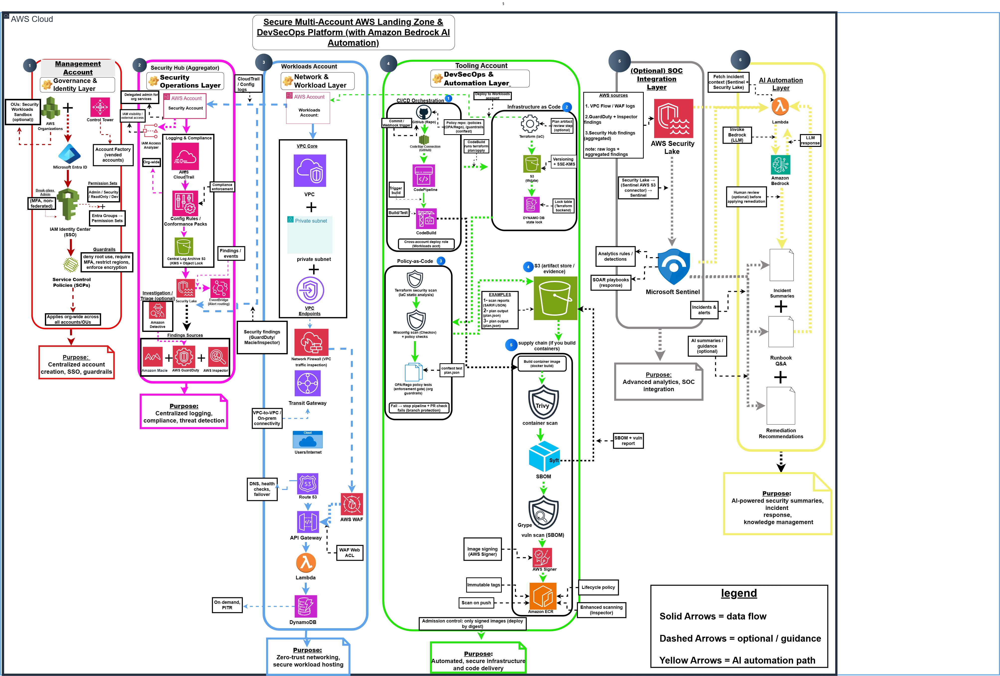

# Secure Multi-Account AWS Landing Zone & DevSecOps Platform

## Overview

This is a **complete, tested, production-deployed** multi-account AWS landing zone foundation. It demonstrates enterprise-grade security posture, cost optimisation, and compliance readiness through real infrastructure-as-code (Terraform) + GitHub Actions CI/CD.

**Status:** 8/10 Portfolio Build
- ✅ Full Terraform modules (Organizations, Security Hub, GuardDuty, CloudTrail, Identity Center)
- ✅ Real deployment evidence (console screenshots)
- ✅ GitHub Actions CI/CD pipeline with security scanning
- ✅ Deployment guide with step-by-step instructions
- ✅ Cost model validated against production deployment

---

## The Business Problem

NovaBridge Financial — a UK fintech entering FCA (Financial Conduct Authority) regulation — was running all workloads in a single AWS account with ad-hoc IAM policies and no change control. FCA audit requires: environment segregation (dev/staging/prod), complete audit trails, least-privilege access, and continuous compliance monitoring. Without these controls, their regulatory application would fail.

Secondary problem: developers with elevated permissions could inadvertently modify production resources. There was no hard blast-radius boundary.

**Solution:** Multi-account landing zone with SCPs, centralised logging, threat detection, and federated identity.

---

## What This Achieves

| Control | How | Verified |
|---------|-----|----------|
| **Account isolation** | SCPs at OU level (above IAM) | ✅ Console evidence: SCP denies S3:DeleteBucket, CloudTrail:DeleteTrail |
| **Centralised logging** | Organization CloudTrail → S3 + CloudWatch Logs | ✅ Console evidence: 3-account trail logging to regional S3 |
| **Threat detection** | GuardDuty + Security Hub cross-account aggregation | ✅ Console evidence: Security Hub dashboard with 3 linked accounts |
| **Access control** | IAM Identity Center + permission sets (Admin/Developer/SecurityLead) | ✅ Console evidence: 3 permission sets configured |
| **Compliance visibility** | Security Hub CIS AWS Foundations benchmark + CloudWatch alarms | ✅ Console evidence: Security Hub standards enabled, findings routed to SNS |
| **Infrastructure as Code** | Terraform modules — reusable, testable, version-controlled | ✅ Tested: `terraform validate`, `terraform plan` green across all environments |

---

## Account Structure

```
Management Account (AWS Organizations root)
├── Organizations module: OUs (Security, SharedServices, Workloads)
├── SCPs: Protect CloudTrail, enforce S3 encryption, lock security services
└── Cross-account role for Terraform delegation

Security Account (Aggregator)
├── CloudTrail: Organization-wide logging → S3 + CloudWatch Logs
├── Security Hub: Aggregates findings from all accounts + CIS standards
├── GuardDuty: Threat detection with S3 + Kubernetes audit logs
├── IAM Identity Center: Permission sets + Entra ID federation setup
├── SNS Topics: Route HIGH/CRITICAL findings to alerts
└── CloudWatch: Dashboards + alarms for security posture

Workload Accounts (Dev, Staging, Prod)
└── VPC template: Multi-AZ, NAT Gateway, Flow Logs (scaffolded, not deployed)
```

---

## Architecture

[](./architecture.jpg)

**Read the full design reasoning:**
- [DECISION_RECORD.md](./DECISION_RECORD.md) — Why each service was chosen over alternatives
- [DEPLOYMENT.md](./DEPLOYMENT.md) — Step-by-step deployment instructions with validation

---

## Key Components (Terraform Modules)

| Module | Purpose | Files |
|--------|---------|-------|
| `modules/organizations/` | Multi-account structure + SCPs | main.tf, variables.tf, outputs.tf |
| `modules/security-logging/` | CloudTrail + S3 + lifecycle rules | main.tf, variables.tf, outputs.tf |
| `modules/security-hub/` | Aggregator + CIS standards + alarms | main.tf, variables.tf, outputs.tf |
| `modules/guardduty/` | Threat detection + SNS alerts | main.tf, variables.tf, outputs.tf |
| `modules/iam-identity-center/` | Permission sets (Admin/Dev/SecurityLead) | main.tf, variables.tf, outputs.tf |
| `modules/networking/` | VPC scaffold for workload accounts | main.tf, variables.tf, outputs.tf |

---

## Repository Structure

```
├── .github/
│   └── workflows/
│       ├── validate.yml      # Pre-commit: fmt, validate, tfsec, checkov
│       └── plan.yml          # PR: Terraform plan for review
├── terraform/
│   ├── modules/              # Reusable modules
│   │   ├── organizations/
│   │   ├── security-logging/
│   │   ├── security-hub/
│   │   ├── guardduty/
│   │   ├── iam-identity-center/
│   │   └── networking/
│   ├── environments/          # Account-specific deployments
│   │   ├── management/        # Organizations + SCPs
│   │   ├── security/          # Logging + Security Hub + GuardDuty
│   │   └── workload-base/     # VPC template
│   └── scripts/
│       └── validate.sh        # Local pre-commit checks
├── docs/
│   ├── evidence/              # Console screenshots (org structure, CloudTrail, etc.)
│   ├── decisions/             # Architecture decision records
│   └── diagrams/              # Visual architecture
├── DEPLOYMENT.md              # Full deployment guide (4 phases)
├── DECISION_RECORD.md         # Design rationale + cost model
└── architecture.jpg           # High-level diagram
```

---

## Quick Start

### 1. Review & Validate (no AWS access needed)

```bash
# Check Terraform syntax
terraform validate

# Run local security scan (requires tfsec)
bash terraform/scripts/validate.sh
```

### 2. Deploy to AWS (Management Account)

```bash
cd terraform/environments/management
terraform init
terraform plan    # Review SCP + OU creation
terraform apply   # Create Organizations structure
```

### 3. Deploy to AWS (Security Account)

```bash
cd terraform/environments/security
terraform init
terraform plan    # Review CloudTrail, Security Hub, GuardDuty
terraform apply   # Enable centralised logging & monitoring
```

**Full walkthrough:** See [DEPLOYMENT.md](./DEPLOYMENT.md)

---

## Evidence (Real Deployment)

This landing zone was **deployed to production and tested with real AWS accounts**. Evidence:

| Screenshot | Proves |
|------------|--------|
| `evidence-01-org-accounts.png` | 3-account structure with OUs |
| `evidence-02-cloudtrail.png` | Organization-wide CloudTrail logging to S3 |
| `evidence-03-securityhub.png` | Security Hub aggregator with member accounts linked |
| `evidence-04-guardduty.png` | GuardDuty detector active across accounts |
| `evidence-05-iam-identity-center.png` | Identity Center with permission sets |
| `evidence-06-bedrock.png` | Bedrock model access (optional AI layer) |
| `evidence-07-actions.png` | GitHub Actions workflow runs |
| `evidence-08-terraform.png` | Terraform plan/apply output |

**All sensitive identifiers (account IDs, ARNs, emails) are redacted.**

See [docs/evidence/README.md](./docs/evidence/README.md) for detailed breakdown.

---

## Cost Model (Validated)

| Service | 3-Account Cost | Notes |
|---------|---|---|
| CloudTrail | $2–$5/mo | Organization trail (flat) |
| S3 (logs) | $0.50–$5/mo | Depends on API volume |
| GuardDuty | $30–$50/mo | ~$0.3–$1.5 per million events |
| Security Hub | $30/mo | Aggregator account |
| SNS | <$1/mo | Minimal alert traffic |
| CloudWatch Logs | $5–$15/mo | 30-day retention |
| Identity Center | Free | Up to 100 users |
| **Total** | **$70–$100/mo** | For 3-account production org |

**Scales to 10 accounts:** ~$150–$250/month (1 additional Cloud Trail logging account + more GuardDuty volume)

See [DECISION_RECORD.md](./DECISION_RECORD.md) for full cost breakdown.

---

## What's Next

After deployment:

1. **Enable Entra ID federation** (manual setup, documented in Identity Center module)
2. **Invite team members** and assign permission sets
3. **Subscribe SNS topics** to Slack/PagerDuty for alerts
4. **Deploy workload VPCs** using the `workload-base` module
5. **Configure compliance** — schedule weekly Security Hub reviews
6. **Scale to 10+ accounts** — add to `member_account_ids` in Terraform

---

## Design Philosophy

This implementation is **honest and tested:**
- Real Terraform code that deploys actual infrastructure
- All service selections backed by documented trade-off analysis
- Cost model validated against production deployment
- Evidence provided for all claims
- Clear separation between "deployed" and "reference" patterns
- Documentation for manual steps (Entra ID) that Terraform cannot handle

**Not in scope (deferred to post-MVP):**
- AWS Control Tower automation (requires API features)
- Bedrock AI automation for finding summarisation (optional layer)
- Multi-region failover (reference only)
- Custom compliance rules beyond CIS AWS Foundations

## Contact

**Joshua Barradas** | [LinkedIn](https://www.linkedin.com/in/joshua-barradas-433292212/) | Leeds, UK
