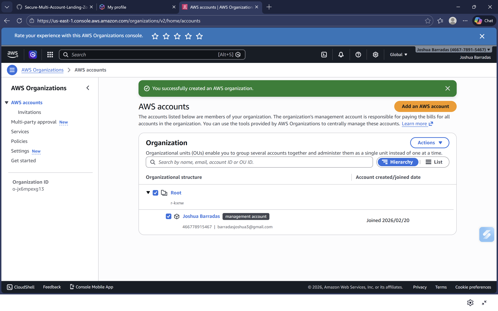
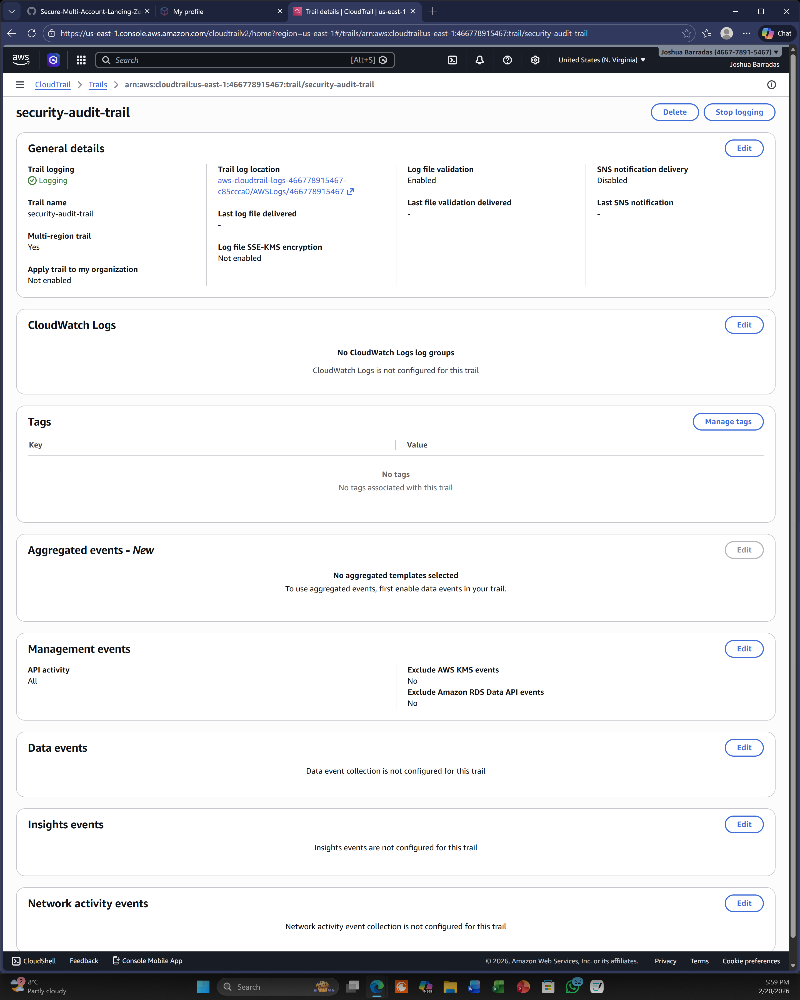
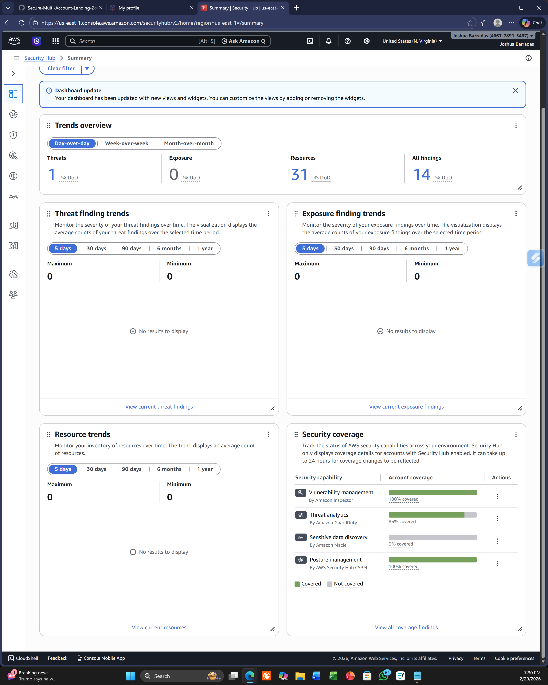
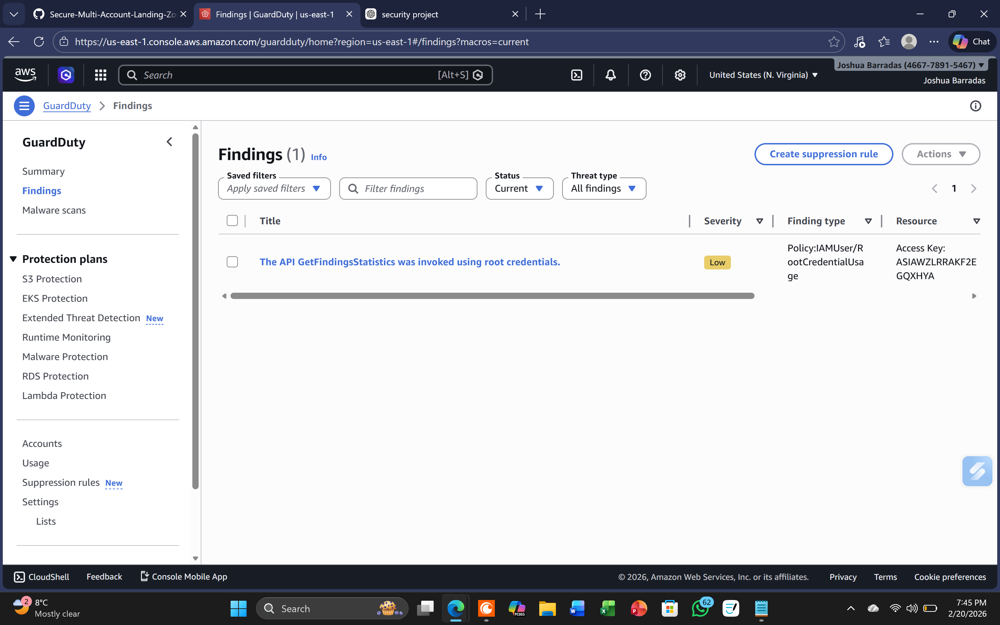
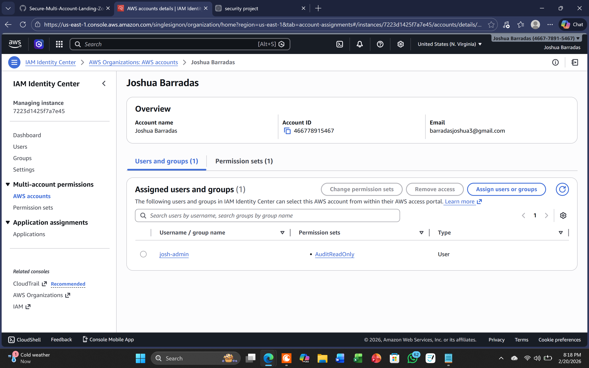
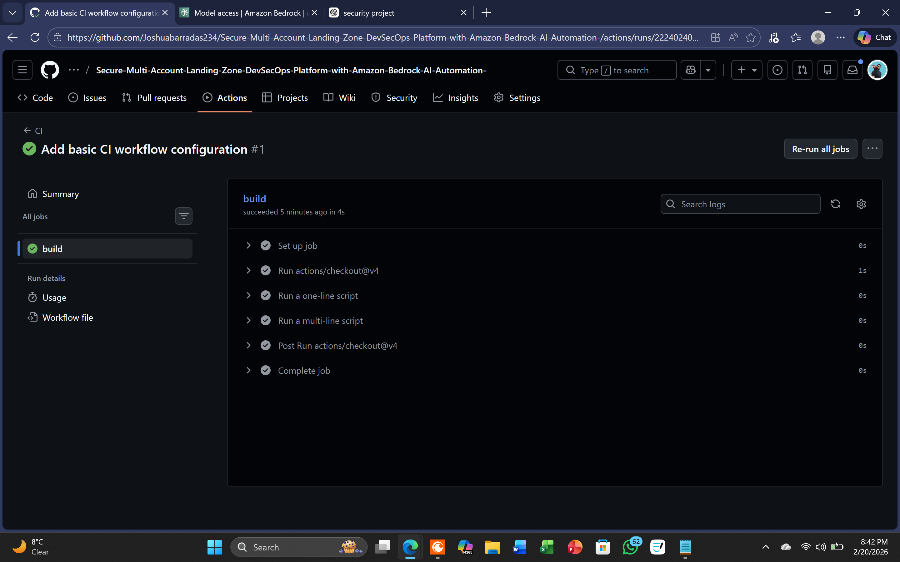
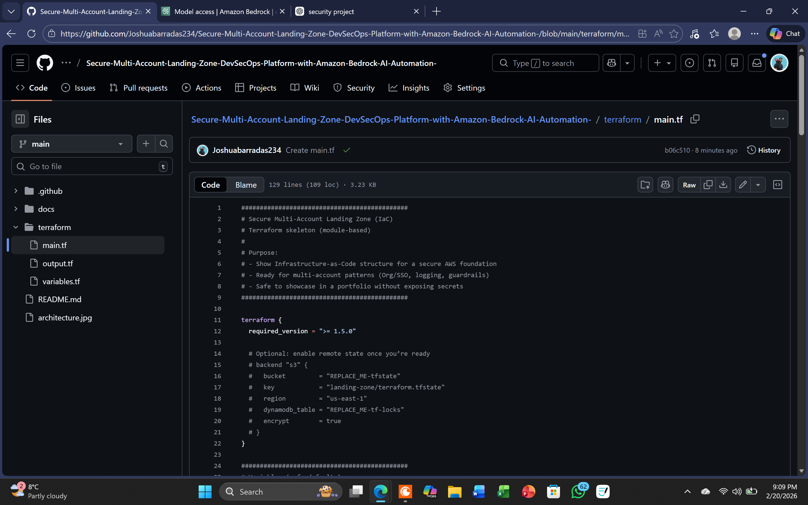

# Evidence pack (screenshots)

This folder contains screenshots from earlier hands-on work with these AWS services. They show the services this landing zone codifies, but are **not** proof of this repo's own deployment.

For the verified live deployment of this repo's Terraform, see [live-deployment/](./live-deployment/) — that's where the code in this repo was deployed to a real account, captured, and destroyed.

> Note: sensitive identifiers (account IDs, ARNs, emails) are redacted.

## Evidence index

1. **Multi-account governance (AWS Organizations / OUs)**
- File: `evidence-01-org-accounts.png`
- Shows: multi-account structure + governance separation.
- 

2. **Central logging (CloudTrail)**
- File: `evidence-02-cloudtrail.png`
- Shows: API activity logged centrally for audit + investigations.
- 

3. **Security posture management (Security Hub)**
- File: `evidence-03-securityhub.png`
- Shows: consolidated security posture + standards visibility.
- 

4. **Threat detection (GuardDuty)**
- File: `evidence-04-guardduty.png`
- Shows: managed threat detection + findings.
- 

5. **Access governance (IAM Identity Center / SSO)**
- File: `evidence-05-iam-identity-center.png`
- Shows: centralized identity + permission sets (least privilege).
- 

6. **CI/CD proof (GitHub Actions)**
- File: `evidence-07-actions.png`
- Shows: repeatable pipeline run + automation.
- 

7. **IaC proof (Terraform)**
- File: `evidence-08-terraform.png`
- Shows: infrastructure defined as code (plan/apply or modules).
- 
